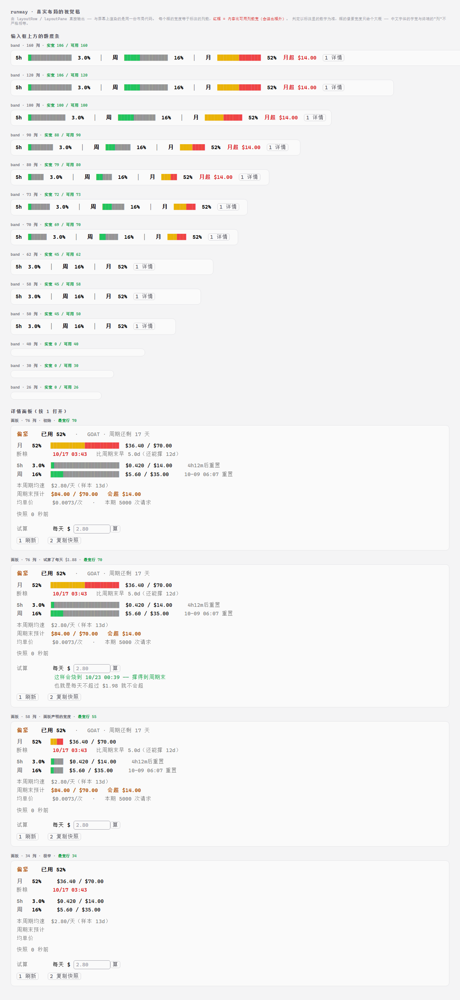

# runway

一个 Claude Code **mod**：把 **Command Code 套餐额度**画在输入框上方，让你一眼看清
三个额度窗口各自还剩多少、照当前速度会走到哪。

```
GOAT  5h ██████████████ 3.0%  │  周 ██████████████ 16%  │  月 ██████████████ 52%  1 详情
      └ 1 亮 + 13 暗          └ 2 亮 + 12 暗            └ 7 黄 + 7 红（会冲过上限）
```

最左边是**会员名**（`Go` / `GOAT` / `Pro` / `Max`）—— 那是你花钱买的那一档，会分好几种。
它的**颜色**跟着档位走（`success` / `warning` / `error`），所以「红色会员名 = 有问题」
这个信号还在，但不需要再写一个字。

> 曾经这里放的是**档位词**（`宽裕` / `偏紧` / `吃紧` / `断粮`）。用户原话：
> "这偏紧两个字放在这毫无意义……你要么就不加，或者你说啊，我们这是 goat 的会员。"
> 档位由颜色和三个窗口的条已经说清楚了，重复写一遍只是占地方。
> 拿不到会员名时才退回档位词 —— 总比空着强。



<sub>上图由 `tools/mock.mjs` 调用**真实的布局函数**渲染，与真机同源；配色是近似值，以实际主题为准。</sub>

## 为什么需要它

Claude Code 的 statusLine **在 Claude Desktop 的 Code tab 里不渲染** —— 你自己写的
statusLine 脚本在终端里正常，切到 Desktop 就是一片空白。

mod 的 `AbovePrompt` band 是那个表面上唯一能常驻放东西的地方，所以有了这个。

## 落点条

**三个窗口等权重地摆在一行，各自一条条，中间用 `│` 分隔。**

条上全程只用 `█` 一个字符，**靠颜色区分三段**：

| 颜色 | 含义 |
|---|---|
| 亮色（绿 / 黄 / 红） | 已经花掉的 |
| 红色 | 按当前速度**还将花掉**的（只在会冲过上限时出现） |
| 暗色 | 照这个速度**会剩下来的**（余量） |

会不会爆表**不用读字**：右半截变红、暗色余量段消失，就是同一件事的两种画法。
轴固定 0→100%，不画刻度 —— 条的末端就是上限。

撑得住时「已用」和「落点」同色合成一根完整的条，于是：

> **一根条一个颜色 = 安全；出现红色 = 会爆表。**

这点和普通的进度条不一样。普通条只说「现在到哪了」；这一根同时说「照这么走下去会到哪」。

### 为什么是同一个字符

早期版本用 `█ / ▒ / ░` 表示 100% / 50% / 25% 三种墨量。实际渲染出来，同一根条看起来
像三种不同的东西拼在一起，高矮粗细对不齐，很别扭。现在三段是同一个字形，天然对齐。

同理，**没有图标**。曾经用 `◑`（半填充圆）表示档位，实测在真实字体里会渲染成一个
大圆圈，既不协调也没人认得。档位现在只靠**颜色 + 词**（`宽裕` / `偏紧` / `吃紧` /
`断粮` / `采样中`）表达。

## 三个窗口，不是一个

设计上踩过两次坑，都记在这里：

1. 第一版让「月」独占一根 30 格的大条，把 周 / 5h 挤成了没有分隔的小文字标 ——
   看不到另外两个窗口，也分不清哪段是哪段。
2. 第二版改成三条，但宽度分配算错了（没算段间距），窄屏下 5h / 周 还是被整段丢掉。

现在三条**给同样的宽度、一起伸缩**，谁也不会把谁挤没。挤不下时按这个顺序让位：
**先丢条 → 再丢档位词**，但**三个窗口的标签和百分比永不丢**。
50 列时退化成 `5h 3.0%  │  周 16%  │  月 52%  1 详情`，仍然一眼看得全。

> 顺序是**反**过来的：早期版本先丢档位词、再去纠结条。后果是窄屏下既没有条、也没有结论，
> 只剩三个裸数字。条和百分比说的是同一件事，档位词是整行唯一的结论 —— 该先牺牲谁很清楚。

如果连这个最精简的骨架都放不下（窄于约 20 列），**退化成一个百分比**（`月 52%`），
而不是什么都不画：空白和「mod 没装」长得一模一样，说不出任何事。

## 取色：条听节奏，不只听填充率

填充率 52% 看着安全，但按当前速度会提前 5 天烧完 —— 画成绿色就是骗人。
所以月额度的颜色由**节奏**决定：

| 情况 | 档位词 | 条的颜色 |
|---|---|---|
| 还有余量、撑得到周期结束 | 宽裕 | 绿 |
| 会提前烧完，但还能撑 > 3 天 | 偏紧 | 黄 |
| 会提前烧完，且只剩 ≤ 3 天可撑 | 吃紧 | 红（加粗） |
| 余量为零 | 断粮 | 红（加粗） |
| 周期太短、样本不足 | 采样中 | 不取色 |

> **判据是「还能撑多久」，不是「缺口多少天」。** 这两者方向相反：
> 早 13 天烧完比早 1 天烧完严重得多，但按缺口天数判会给前者「偏紧/黄」、
> 后者「吃紧/红」—— 颜色和紧挨着的数字对着干（「吃紧」配「还能撑 15d」、「偏紧」配「还能撑 2.3d」）。
> 早期版本就是这么写的，README 和测试都把反向判据一起固化了，所以一直没被发现。

### ⚠️ 颜色写错，整条 band 会消失

引擎对 `color` / `backgroundColor` / `borderColor` 只做一次检查：

```js
typeof t === "string" && /^[#a-zA-Z0-9_().,% -]{1,40}$/.test(t)
```

**不过就判整棵 `ui.render` 树不合法 → 整棵丢弃、改画引擎自己的版本（= 空白）**，
屏幕上没有任何提示，只在日志里留一句 `a hook returned a tree that does not validate`。
而 `claude plugin validate` **抓不到这一条**。

所以：

- **冒号不在那个字符集里** → `ansi:red` 这种写法必然失败。用主题令牌
  `success` / `warning` / `error`（它们在字符集内，而且会跟着明暗主题走）。
- band 是中间件链，每个 mod 写 `return Box({ children: [rest, mine] })` 时
  **三棵树会合并成一棵**再一起校验 —— 一处颜色写错，**三个 mod 一起消失**。
  这就是「mod 突然全没了、查了半天」的那次事故。
- 代码里 `textOf()` 出门前会先过一遍这个字符集，不合法的颜色**直接不写**：
  少一个颜色只是少一个颜色，不会连累别人。

`tools/tree_lint.mjs` 把引擎这套规则重实现了出来（属性白名单、枚举值、容量上限、
颜色字符集），`tests/tree.test.ts` 拿它驱动**真实的 `register.mjs`**，
跑 8 个数据态 × 10 个列宽 × 桌面/手机 × band/pane。它是一道网，不是保证 ——
引擎改规则而我们没跟上，它会漏。

### 滚动窗口的样本门槛比月度严得多

月度用「已过 5% 周期」就能给结论，因为它的消耗是匀速的。
**滚动窗口不行** —— 实测 5h 窗口跑了 16 分钟、用了 7.4%，按 5% 门槛恰好放行，
外推出来是 **139% 的假警报**。

现在滚动窗口要求**已过 20% 的窗口长度**（5h 要跑满 1 小时、周窗口要过 1.4 天）
才给落点，之前那条只画普通的水平条。

（原版 `commandcode-usage` 干脆不在状态栏显示 5h 的预测，也是这个原因。）

## 交互

| 操作 | 效果 |
|---|---|
| 空输入框里按 `1` | 打开详情面板（不用点、不用切焦点） |
| 面板里改「试算」的数字 + 回车 | **换一个花法会怎样** —— 纯本地算术，立刻算出新的断粮时刻 |
| 面板里 `1` 刷新 / `2` 复制快照 | 立即取数 / 复制一屏可贴的摘要 |
| `/quota` | 打印完整的文本快照 |
| `/quota models` | 打印**完整**的模型次数表（markdown 表格）。会**强制重抓一次**官方文档页 —— 显式要表就是要现在的真相 |
| `Esc` | 关面板 |

面板里还有：

- **一行结论** —— 面板第一行就是「够不够、什么时候用完」：
  `偏紧    预计 10/11 01:27 断粮 · 还能撑 5.3d`。第二行是 `周期末预计 $95 / $70.00   会超 $25.00`。
  这两件是用户打开面板想知道的**唯二**的事，所以它们在第一屏 ——
  以前它们夹在三行裸数字和一串参考值中间，还得自己找。
- **周期进度** —— `周期已过 47%，额度已用 72%`。
  **单看「已用 72%」没有参照系**：配上前半句才知道是花快了。差值超过 10 个点标黄。
- **安全线** —— `每天 ≤ $2.50 就不会超`。把「会超」这个结论翻译成一个当天就能执行的目标。
  以前它只在试算成功之后才出现，等于藏在"你得先试算一次"后面。
- **模型次数表** —— 「这个套餐里哪些模型便宜好用、官方有没有上新」。
  带框线的两列表，默认列前 8 名（`PANE_MODELS` 可调）：按**每月次数降序**
  （次数最多 = 每美元买到最多请求），新增/改价的**钉在最前面**并在名字右侧标
  `★新`（绿）/ `↑价`（黄）。放不下的走 `/quota models`。
- **断粮时刻** —— 面板第一行给的是**时刻**（`10/11 01:27`）而不是"还剩 5.3 天"这个长度。
  长度可以拖，时刻不能；人会自动把时刻跟日历上别的事对照，所以它比天数扎心得多。
- **试算器** —— 输入「如果每天只花 $1.88」，它立刻告诉你
  `这样会烧到 04/01 00:13 —— 撑得到周期末`。

### 面板的信息架构

从上到下是**紧迫度递减**的一条轴，块之间用空行分隔：

| 块 | 回答 | 视觉手段 |
|---|---|---|
| 结论（2 行） | 够不够 / 何时断 / 会超多少 | 全篇**唯一**的加粗彩色 |
| 三个额度窗口（3 行） | 现在到哪了 | 唯一的进度条 + 加粗百分比 |
| 节奏（4 行） | 照这花法会怎样、该改成怎样 | 全暗，想深究才看 |
| 模型（标题 + N 行） | 哪些便宜好用 | 参考信息 |
| 工具（试算 / 快照 / 按钮） | 动手 | 最下 |

**永不砍**：第一行结论、三个窗口的**名字 + 百分比**（README 两次踩坑换来的硬约束）。

### 面板里那张表：试了两版框线，最后不画线

模型次数是两列对齐的表，但**没有框线**。这个结论是失败两次换来的：

| 版本 | 做法 | 怎么坏的 |
|---|---|---|
| 一 | 框线用 box-drawing（`┌─┬┐│`） | 它们是 **East Asian Ambiguous** 宽度，占一格还是两格**由字体决定**，中文环境下常被渲染成两格。宽度按一格算 → **横线比表格长一倍**，整张表散架 |
| 二 | 换成 ASCII 框线（`+ - |`） | 字符宽度没问题了，但**一行被切成了好几个段**（名字 / 标记 / 数字，为了给标记单独染色）。面板把每段渲染成独立的文本节点，而**节点边界的空白会被吃掉** —— 补齐的空格正好落在边界上，列全歪 |
| 三 | **不画线，一行一个单段字符串** | ✅ |

第三版的两条要点：

- **一行只能是 `{ text }` 一个段。** 补齐的空格是这段文字的一部分，不会被重算，
  所以列**对得齐**。`tests/catalog.test.ts` 里有断言钉着：每行 `r.length === 1`。
  （代价：整行一段，标记没法单独染色 —— 染了整行都会变绿。`★新` / `↑价` 靠字形本身醒目。）
- **不画框线。** 面板里没有 markdown 那种表格样式，ASCII 框线只会显得笨重；
  box-drawing 又赌不起字体。所以只留列、不留线。

```
模型次数 · 每月可调用次数（越多越省）· 51 个 · 官方 16 分钟前更新
模型                         每月调用
MiMo V2.6 Flash           ★新  64,900
LongCat 2.0               ★新  64,100
Jev                           595,000
DeepSeek V4 Flash (latest)    154,000
… 其余 45 个 · /quota models 看全表
```

顺带记一条同样重要的：**对齐不能靠定宽 `Box`。** `Box` 的 `width` 只是 flex-basis，
而引擎给 Box 的默认值里有 `flexShrink: 1` —— 主轴放不下时定宽会被一路压回内容宽，
短名字那行的数字就跑到左边去。真要用定宽得 `width` + `minWidth` 同值 + `flexShrink: 0`，
且列宽之和 ≤ 面板列数。证据：CLI 里 `jg = {…, flexShrink:1, …}` 与 props→yoga 桥接的
`setFlexShrink`/`setWidth`。

会话里的 `/quota models` 是两回事：它走 **markdown 渲染**，连续空格会被吃掉，
所以那里用真正的 markdown 表格（`---:` 让数字列右对齐），交给渲染器排 —— 那个反而是最好看的。

### 面板先适配侧边栏

点「详情」默认打开的是**停靠的侧边栏**，实测 `bodyColumns = 50`（band 是 95）。
**一切以 50 列为准**：表格在这个宽度下是 45 格，每一行精确等宽。
展开的大面板更宽，同一套布局自然铺开。

额度跨档时主动弹一次 toast（每档每周期只报一次）。读数陈旧超过两个刷新周期时整行转暗。

## 安装

**需要 Claude Code v2.1.287 或更新**（mods 是那个版本引入的）。

### 单独试跑

```bash
claude --plugin-dir /path/to/runway
```

热重载：改完存盘即生效。

### 常驻（含 Claude Desktop 的 Code tab）

Desktop 传不了命令行参数，所以用这个环境变量 —— 它就是为「拿不到 flag 的 app」设计的，
写在 `~/.claude/settings.json` 里：

```json
{
  "env": {
    "CLAUDE_CODE_PLUGIN_DIRS": "/path/to/runway"
  }
}
```

Windows 上多条路径用 `;` 分隔，其他平台用 `:`。撤销就是删掉这一行。
用 `claude plugin list` 看 `runway@inline` 是否 `loaded`。

### 从 marketplace 装

把本仓库当作 marketplace 加进去：

```bash
claude plugin marketplace add Jovan1666/claude-code-runway
claude plugin install runway@claude-code-runway --scope user
```

## 数据来源

打 `api.commandcode.ai` 的三个端点：

```
GET /alpha/billing/credits?orgId=         → windowLimits.{fiveHour,weekly} + credits
GET /alpha/billing/subscriptions?orgId=   → 计划与计费周期
GET /alpha/usage/summary?since=<周期起点>  → 花费与均价
```

`/alpha/whoami` 省掉了：实测它返回的 `org` 恒为 `null`，而 `credits` 并不需要 `orgId`。

凭据按顺序找：

1. 环境变量 `COMMAND_CODE_API_KEY` / `COMMANDCODE_API_KEY` / `CMD_API_KEY`
2. `settings.json` 的 `env` 段中名字含 `commandcode` 的项
3. 配置文件里嵌套的 `access.apiKey` + 匹配 `commandcode.ai` 的 `api.baseUrl`，
   按 `~/.zcode/v2/provider_config.json` → `~/.config/opencode/opencode.json` →
   `~/.pi/agent/settings.json` → `~/.claude/settings.json` 的顺序找

**读不到凭据就什么都不画** —— 不占位置，也不报错。取数失败保留上一次读数并标注陈旧。

刷新：会话启动取一次，之后每 180 秒一次，每轮对话结束后去抖（15 秒）补一次。
**渲染路径永远不发网络请求** —— `ui.render` 每帧都跑。

滚动窗口的落点用重置时刻倒推窗口起点：
`elapsed = 窗口长度 − 距下次重置的时间`（5h 窗口 5 小时、周窗口 7 天）。

### 模型次数表

「这个套餐下每个模型还能调用多少次」**不在 API 里** —— `/alpha/*` 不暴露那张表。
官方只把它公布在**公开文档页**上，所以这一项走另一个来源：

```
GET https://commandcode.ai/docs/plans/<slug>      头：RSC: 1
```

返回的是 Next.js 的 flight 流（`text/x-component`，约 200 KB）。解析不按 record id
（每次部署都会变），只按**结构签名**找那条记录。口径和官方页面一致：

```
每次成本 = 输入/1e6×输入单价 + 输出/1e6×输出单价 + 缓存读/1e6×缓存读单价
月次数   = 该模型的 budgetUsd ÷ 每次成本        5h = 月 × fiveHourFraction
                                                周 = 月 × weeklyFraction
```

**每个模型有自己的 `budgetUsd`**（GOAT 里 DeepSeek V4.1 Flash 是 $60、GPT-5.6 Sol 是 $70），
套餐级的 $70 不参与这条公式 —— 官方两处口径不同，不能互相推算，界面上也照实这么写。

| | |
|---|---|
| 刷新 | **24 小时**一次（模型上下架、调价是天级的事，跟着 180 秒抓等于敲人家的文档页）。失败隔 6 小时再试 |
| 变更标记 | 每次抓回来和上一份比：`★新` / `↑改价`，并**钉在表面**（用户要的就是这个）；内容没变就不推进"上一份"，免得标记被洗掉 |
| 降级 | 抓失败保留旧目录并标出「多久之前抓的」；从没抓到过就整段不显示，**不影响额度条** |
| 页面 | 官方 planId → 文档页 slug：`individual-goat`→`goat`、`individual-go`/`-go-v1`→`go`、`individual-max`/`-ultra`→`max`。Go 改过代，窗口系数按 planId 覆盖（老的 0.2/0.5，新的 0.3/0.6） |

⚠️ 官方忽略 `If-*` 条件头，所以没有用 ETag 做变更探测，直接比内容指纹。

## 开发

```bash
node tools/preview.mjs        # 取真实数据，打印额度条 / 面板 / 命令输出（纯文本）
node tools/preview.mjs --json # 额外 dump 归一化后的对象
node tools/mock.mjs --demo    # 用合成数据写出带颜色的视觉稿 tools/mock.html
node tools/mock.mjs --real    # 用真实读数出图（默认拒绝，见下）
node tools/privacy-scan.mjs   # 提交前跑：仓库里有没有混进本机的真实读数
claude plugin validate .      # 静态检查：列出 hooks、$ 调用、读写哪些环境变量
claude plugin test .          # 纯函数测试，不需要会话或网络
```

### 隐私：真实账单数据不得入库

这个口子**栽过三次**，每次都是同一个动作 —— **把真机屏幕上的数字抄进测试夹具或文档**
（金额、请求数、均价三者一起出现就等于公开账本；有一次还写进了"别抄真实数据"的警告注释里）。

所以有一道自动检查。它不维护"敏感值清单"（清单本身就是泄露），而是**读本机此刻的读数**
（mod 自己缓存的那份）再拿去 grep 仓库：

```bash
node tools/privacy-scan.mjs        # 命中就以非 0 退出，别提交
node tools/privacy-scan.mjs --all  # 连未跟踪的文件一起扫
```

**局限（它是一道网，不是保证）**：只抓"此刻缓存里还在"的数；很久以前抄进去、
缓存已经滚过去的抓不到；四舍五入改写过也抓不到。**所以夹具值仍然必须自己编**，
照 `tests/quota.test.ts` 那份合成基准写，而且要编得像样。

`claude plugin test` 跑三个文件，66 条：

| 文件 | 管什么 |
|---|---|
| `tests/quota.test.ts` | 额度换算、落点条、排版、降级顺序；**颜色必须过引擎的字符集** |
| `tests/catalog.test.ts` | 模型目录的解析与换算、新增/改价、表格排版（列宽契约） |
| `tests/tree.test.ts` | 把**真实的 `register.mjs`** 产出的树喂进 `tools/tree_lint.mjs`：8 数据态 × 10 列宽 × 桌面/手机 × band/pane |

`tools/tree_lint.mjs` 把引擎那套 `ui.render` 树校验**重实现**了一遍（属性白名单、
枚举值、容量上限、颜色字符集），常量逐条对得上 CLI 二进制。它是防「整条 band 静默消失」
的护栏 —— `claude plugin validate` **抓不到**这一类。它是一道网，不是保证：
引擎改规则而这里没跟上，它会漏。

> **视觉稿默认拒绝真实读数。** 这个工具的产物 `tools/mock.html` 就是拿来截图贴进
> 本文档的，真实读数一旦落到 `docs/` 就跟着仓库一起公开了。
> 所以不带 `--demo` 时必须显式加 `--real` 才会取真实数据。
>
> 视觉稿的每一个候选框都**按标注的列数定宽**，标注里给出「实宽 / 可用」，
> 超宽标红。这是为了能看见溢出：早期版本用 `overflow-x:auto` 让浏览器自己横向回流，
> 于是 58 列的面板和 76 列的面板在视觉稿里**一样宽** —— 面板比它声明的列数
> 宽 12 格这件事从来没被看出来过。
>
> 框的像素宽度只是近似：中文字体在浏览器里的字宽与终端的「列」不严格相等，
> **判定以标注里的数字为准**。

> **2.1.288 上的一个坑**：本仓库根目录同时有 `.claude-plugin/marketplace.json`，
> 而 2.1.288 的 `claude plugin validate` 遇到这种情况会**只校验 marketplace、
> 跳过插件本身**（不再输出 `hooks:` / `calls:` 那套静态分析）。这是 2.1.289 修掉的
> 已知 bug。在 2.1.288 上想看静态分析，复制一份去掉 marketplace 清单再校验：
>
> ```bash
> T=$(mktemp -d) && cp -r . "$T/" && rm -f "$T/.claude-plugin/marketplace.json" && rm -rf "$T/.git"
> claude plugin validate "$T"; rm -rf "$T"
> ```

### `tools/mock.mjs` 为什么必须存在

**mod 的 band 只在真实会话里渲染，写代码的模型看不到自己的输出。**

这个项目的整个过程就是在证明这一点：早期版本纯靠想象设计，结果条糊成一坨、图标没人
认得、面板还因为一个未定义变量整片空白。后来把 `layoutRow` / `layoutPane` 抽成纯函数，
`hooks/register.mjs` 把「段」变成元素树、`tools/mock.mjs` 把同一批「段」变成 HTML ——
**同一份布局两个出口**，于是浏览器里看到的就是屏幕上的，可以反复比对再定稿。

`lib/quota.mjs` 里不出现 `$`：mods 的静态检查只允许把 `$` 传给**同一文件**里顶层声明的
函数，跨文件传会验证失败 —— 把纯逻辑分出去正好避开这条约束，顺便让它可测、可预览。

## 已知限制

- 只在终端与 Claude Desktop 的 Code tab 渲染。VS Code 面板、`claude -p`、云会话**不绘制**。
- **只统计走 Command Code 这个 provider 的消耗。** 切到别的 provider，这里的数字不会动。
- 档位判定与落点外推用的是**窗口内均速**，不是最近一小时的速度。周期内速度变化大时会偏保守。
- 窄终端（< 110 / 144 列）里面板会静默不放置，此时弹 toast 说明。
- 只在终端与 Desktop Code tab 渲染。VS Code 面板、`claude -p`、云会话**不绘制** ——
  那些场合用 `/quota` 命令。
- mods API 是 **EARLY ACCESS**。在 **2.1.288 上，`ui.render` 交回坏树可能让整个会话以
  `unrecoverable interface error` 结束**（2.1.289 才改成引擎自己兜底）。本 mod 在渲染层
  做了 try/catch，但建议用 2.1.289 或更新。
- 月额度条的颜色由节奏决定，所以填充率低但会超支时它是黄的 —— 刻意的，不是 bug。

## 关于对 token-weather 的依赖

`plugin.json` 里声明了 `dependencies: ["token-weather@claude-code-playground-mods"]`。

band 的多个 mod 是一条中间件链，**某个 hook 返回自己的树而不调 `next(e)` 就短路了排在它
后面的所有 mod**。上游的
[token-weather](https://github.com/anthropics/claude-code-playground/tree/main/claude-code/mods/token-weather)
在有读数时正是这么做的，会把排在它后面的 band mod 整个吃掉 —— 表现是「装了但永远不显示」，
而且极难排查。

**本机的副本已经修过**（两处，同一个毛病）：

| 文件 | 改动 |
|---|---|
| `token-weather.mjs` | 两条 drawing 路径都改成 `Box({ children: [rest, mine] })`；`e.props` 而不是 `e` 读宽度；无读数时画一行状态而不是静默让位 |
| `replay-theater.mjs` | 同样：两个分支都裹 `next(e)`；`e.props` 读 `maxRows` / `bodyColumns` |

这些改动**没有推回上游** —— `claude-code-playground` 是 Anthropic 的仓库，不是我们的。
所以换一台机器重装这两个 mod，就得重新打一遍。

而「装了 mod 的插件里，声明了 `dependencies` 的那个**先跑**」，所以这是唯一能保证顺序的手段。
代价是 token-weather 会被连带启用。

本 mod 一定 `await next(e)` 并把别人的树嵌进外层 `Box`，不会反过来吃掉谁。
**不想装 token-weather 的话，把这行删掉即可** —— 但如果它在你之后加载，这行就不会显示。

## 许可

MIT。见 [LICENSE](LICENSE)。

`Command Code` 是其各自所有者的商标；本项目与它没有隶属关系。
